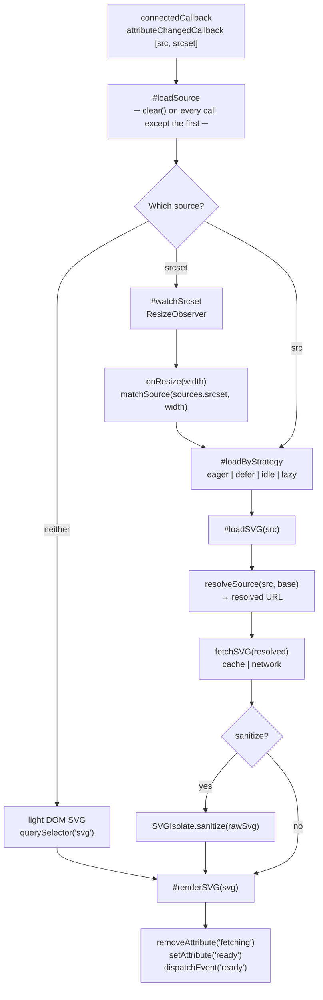

# SVGIsolate

A web component that loads, caches, and renders SVG files in an isolated shadow DOM. Supports multiple loading strategies, srcset-based responsive images, base URL resolution, in-memory caching, and optional sanitization.

---

## Loading Flow



> **Notes**
> - `clear()` is skipped on the very first `connectedCallback` call.
> - `src` passed to `#loadSVG` is always the **raw attribute value** — `resolveSource(src, base)` is called inside `#loadSVG` to produce the final URL.
> - `sanitize` only runs if `SVGIsolate.sanitize` is set **and** the `sanitize` attribute is present on the instance.
> - `currentSource` is set after a successful render and always reflects the currently displayed SVG.

---

<!--MARK: Static Properties-->

## Static Properties

| Property            | Type                           | Default         | Description                                                                          |
| ------------------- | ------------------------------ | --------------- | ------------------------------------------------------------------------------------ |
| `VERSION`           | `string`                       | `'0.0.2'`       | Current version of the component                                                     |
| `DEFAULT_TAG_NAME`  | `string`                       | `'svg-isolate'` | Default tag name used when calling `define()`                                        |
| `CACHE_ENABLED`     | `boolean`                      | `true`          | Enables or disables the cache system entirely. Must be set before `define()`         |
| `CACHE_MAX_ENTRIES` | `number`                       | `100`           | Maximum number of entries the cache holds. Must be set before `define()`             |
| `CACHE`             | `SVGIsolateCache`              | —               | Cache instance. Created automatically by `define()` if `CACHE_ENABLED` is `true`     |
| `sanitize`          | `Function \| null`             | `null`          | Static sanitizer function. Receives a raw SVG string and returns a sanitized string  |
| `defaults`          | `object`                       | —               | Default values for all instance properties. See [Defaults](#defaults)                |
| `LOADING`           | `object`                       | —               | Enum of valid loading strategy values. See [Loading Strategies](#loading-strategies) |
| `styleSheets`       | `ComponentStyleSheets \| null` | `null`          | Shared stylesheet collection registered at `define()` time. Populated by `define()`  |

### `sanitize`

Static sanitizer function applied to the raw SVG string before rendering, when the `sanitize` attribute is present on the instance. Must be set before any component renders.

| Parameter | Type     | Description                            |
| --------- | -------- | -------------------------------------- |
| `raw`     | `string` | Raw SVG string fetched from the source |

Returns `string` — the sanitized SVG string.

```js
import DOMPurify from "dompurify";

SVGIsolate.sanitize = (raw) => {
	return DOMPurify.sanitize(raw, { USE_PROFILES: { svg: true } });
};
```

The sanitizer runs after the fetch and before `renderSVG`, so the cache always stores the raw unsanitized string.

<br>

### Defaults

```js
SVGIsolate.defaults = {
	loading: "eager",
	lazyThreshold: 0,
	lazyMargin: "0px",
	sanitize: false,
	useCache: true,
	responsive: false,
	exposeSVG: false,
	base: "/",
};
```

### LOADING

```js
SVGIsolate.LOADING = {
	EAGER: "eager",
	DEFER: "defer",
	IDLE: "idle",
	LAZY: "lazy",
};
```

<br>

<!--MARK: Static Methods-->

## Static Methods

#### `define(tagName?, styleSheets?)`

Registers the custom element and initializes the cache and stylesheets. Must be called before using the component unless using the auto-import bundle.

| Parameter             | Type              | Default         | Description                               |
| --------------------- | ----------------- | --------------- | ----------------------------------------- |
| `tagName`             | `string \| null`  | `'svg-isolate'` | Tag name to register the element under    |
| `styleSheets`         | `object`          | `{}`            | Stylesheets to inject into the shadow DOM |
| `styleSheets.links`   | `string[]`        | `[]`            | URLs of external CSS files                |
| `styleSheets.adopted` | `CSSStyleSheet[]` | `[]`            | Constructed stylesheet objects            |
| `styleSheets.raw`     | `string[]`        | `[]`            | Raw CSS strings                           |

Returns `void`.

```js
SVGIsolate.define("my-icon", {
	links: ["/styles/icon.css"],
	raw: [":host { display: inline-block; }"],
});
```

---

#### `fetchSVG(src, opt?)`

Fetches an SVG file from the given URL. Returns `null` on network error or non-ok HTTP response.

| Parameter      | Type      | Default | Description                                                                          |
| -------------- | --------- | ------- | ------------------------------------------------------------------------------------ |
| `src`          | `string`  | —       | URL of the SVG file                                                                  |
| `opt.sanitize` | `boolean` | `false` | Whether to sanitize the SVG after fetching. Requires `SVGIsolate.sanitize` to be set |

Returns `Promise<string | null>`.

```js
const raw = await SVGIsolate.fetchSVG("/assets/icon.svg");
const sanitized = await SVGIsolate.fetchSVG("/assets/icon.svg", {
	sanitize: true,
});
```

---

#### `resolveSource(src, base)`

Resolves a `src` value against a `base` URL using the same algorithm the component uses internally when loading SVGs.

| Parameter | Type             | Description                                                                        |
| --------- | ---------------- | ---------------------------------------------------------------------------------- |
| `src`     | `string`         | The raw source value — may be absolute, root-relative, or relative                 |
| `base`    | `string \| null` | Base path or URL to resolve against. If `null` or `"/"`, `document.baseURI` is used |

Returns `{ resolved: URL, parts: { origin, basePath, srcPath, search, hash } } | null`.

- If `src` is `null`, returns `null`.
- If `src` is an absolute URL, `base` is ignored and `src` is returned as-is.
- If `base` is `null`, `"/"`, or not provided, `src` is resolved against `document.baseURI`.

```js
SVGIsolate.resolveSource("/icons/circle.svg", "/docs");
// {
//   resolved: URL { href: 'http://127.0.0.1:3000/docs/icons/circle.svg' },
//   parts: { origin: '...', basePath: '/docs', srcPath: '/icons/circle.svg', search: '', hash: '' }
// }

SVGIsolate.resolveSource("https://cdn.example.com/icon.svg", "/docs");
// { resolved: URL { href: 'https://cdn.example.com/icon.svg' }, ... }  ← base ignored
```

---

#### `matchSource(candidates, width)`

Selects the best candidate from a parsed srcset array for a given display width. Picks the smallest candidate whose intrinsic width covers the target width. If no candidate is large enough, returns the largest as a fallback.

| Parameter    | Type                                              | Description                                    |
| ------------ | ------------------------------------------------- | ---------------------------------------------- |
| `candidates` | `Array<{ raw: string, resolved: URL, width: number }>` | Parsed srcset candidates (e.g. from `el.sources.srcset`) |
| `width`      | `number`                                          | Target display width in pixels                 |

Returns `{ raw: string, resolved: URL, width: number } | null`.

```js
const best = SVGIsolate.matchSource(el.sources.srcset, 450);
// candidates: 300w, 600w, 900w → picks 600w (smallest that covers 450px)

console.log(best.resolved.href); // 'https://example.com/icon-600.svg'
console.log(best.width);         // 600
```

<br>

<!--MARK: Instance Properties-->

## Instance Properties

| Property              | Type                        | Attribute             | Default   | Description                                                                                                                     |
| --------------------- | --------------------------- | --------------------- | --------- | ------------------------------------------------------------------------------------------------------------------------------- |
| `src`                 | `string \| null`            | `src`                 | `null`    | URL of the SVG file to load                                                                                                     |
| `srcset`              | `string \| null`            | `srcset`              | `null`    | Comma-separated list of SVG candidates with width descriptors                                                                   |
| `base`                | `string`                    | `base`                | `"/"`     | Base path or URL used to resolve `src`. Falls back to `defaults.base` when the attribute is not set                             |
| `sources`             | `object`                    | —                     | —         | Parsed `src` and `srcset` as structured URL objects. Read-only                                                                  |
| `currentSource`       | `{ raw: string, resolved: URL } \| null` | —        | `null`    | The source that is currently rendered. `null` until the first successful load. Read-only                                        |
| `loading`             | `string`                    | `loading`             | `'eager'` | Loading strategy. One of `eager`, `defer`, `idle`, `lazy`                                                                       |
| `useCache`            | `boolean`                   | `no-cache`            | `true`    | Whether to use the in-memory cache for this instance                                                                            |
| `sanitize`            | `boolean`                   | `sanitize`            | `false`   | Whether to sanitize the SVG before rendering                                                                                    |
| `responsive`          | `boolean`                   | `responsive`          | `false`   | Whether to listen for resize events and swap candidates automatically                                                           |
| `lazyMargin`          | `string`                    | `lazy-margin`         | `'0px'`   | `rootMargin` passed to the `IntersectionObserver` for lazy loading                                                              |
| `lazyThreshold`       | `number`                    | `lazy-threshold`      | `0`       | `threshold` passed to the `IntersectionObserver` for lazy loading                                                               |
| `preserveAspectRatio` | `string \| null`            | `preserveAspectRatio` | `null`    | Forwarded to the rendered `<svg>` element                                                                                       |
| `viewBox`             | `string \| null`            | `viewBox`             | `null`    | Forwarded to the rendered `<svg>` element                                                                                       |
| `observers`           | `Map`                       | —                     | —         | Active observers keyed by name (`'lazy'`, `'resize'`). Read-only                                                                |
| `exposeSVG`           | `string \| boolean \| null` | `expose-svg`          | `null`    | Exposes the inner `<svg>` via `::part()`. `true` uses `'svg'` as the part name, a string sets a custom name, `null` disables it |
| `width`               | `string \| null`            | `width`               | `null`    | Sets `style.width` on the host element. Accepts any valid CSS length. Validated via `CSS.supports()`                            |
| `height`              | `string \| null`            | `height`              | `null`    | Sets `style.height` on the host element. Accepts any valid CSS length. Validated via `CSS.supports()`                           |
| `componentStyles`     | `ComponentStyles`           | —                     | —         | Style manager for this instance's shadow DOM. See [styles.md](./styles.md)                                                      |

### `sources`

Read-only computed property that parses `src` and `srcset` into structured objects with resolved URLs.

| Field    | Type                                                    | Description                                                                                                                                                             |
| -------- | ------------------------------------------------------- | ----------------------------------------------------------------------------------------------------------------------------------------------------------------------- |
| `src`    | `{ raw: string \| null, resolved: URL \| null }`        | Parsed `src` attribute. `raw` is the attribute value as-is, `resolved` is the absolute URL after applying `base`                                                        |
| `srcset` | `Array<{ raw: string, resolved: URL, width: number }>` | Parsed `srcset` candidates in declaration order. Each entry contains the raw value, the resolved absolute URL (with `base` applied), and the width from the `w` descriptor |

```js
// src="icon.svg" base="/assets"
// srcset="/icons/icon-300.svg 300w, /icons/icon-600.svg 600w"

el.sources;
// {
//   src: {
//     raw: 'icon.svg',
//     resolved: URL { href: 'http://example.com/assets/icon.svg' }
//   },
//   srcset: [
//     { raw: '/icons/icon-300.svg', resolved: URL { href: '...' }, width: 300 },
//     { raw: '/icons/icon-600.svg', resolved: URL { href: '...' }, width: 600 },
//   ]
// }
```

Malformed candidates are silently dropped — the rest of the candidates remain unaffected.

<br>

<!--MARK: Instance Methods-->

## Instance Methods

#### `loadSVG(src, opt?)`

Fetches and renders an SVG from the given URL. Respects the current `useCache` and `sanitize` settings unless overridden via `opt`.

| Parameter      | Type      | Default | Description                                                         |
| -------------- | --------- | ------- | ------------------------------------------------------------------- |
| `src`          | `string`  | —       | URL of the SVG file to load (set as the `src` attribute)            |
| `opt.base`     | `string`  | —       | Override the `base` attribute for this load                         |
| `opt.useCache` | `boolean` | —       | Override the `useCache` setting for this load                       |

Returns `void`.

```js
el.loadSVG("/assets/icon.svg");
el.loadSVG("circle.svg", { base: "https://cdn.example.com/icons" });
```

---

#### `renderSVG(svg)`

Renders an SVG into the shadow DOM. Dispatches the `ready` event and sets the `ready` attribute on completion.

| Parameter | Type                   | Description                       |
| --------- | ---------------------- | --------------------------------- |
| `svg`     | `string \| SVGElement` | Raw SVG string or an SVG DOM node |

Returns `void`.

```js
el.renderSVG('<svg xmlns="http://www.w3.org/2000/svg">...</svg>');

// or from a DOM node
const node = document.querySelector("svg");
el.renderSVG(node);
```

---

#### `clear()`

Disconnects all active observers, removes the rendered SVG from the shadow DOM, and resets `currentSource` and the `ready` attribute. Called automatically before every new load and on `disconnectedCallback`.

Returns `void`.

```js
el.clear();
```

<br>

<!--MARK: Attributes-->

## Attributes

### Reactive attributes

Changes to these attributes are observed and trigger the component to update automatically.

| Attribute             | Type     | Description                                                                                  |
| --------------------- | -------- | -------------------------------------------------------------------------------------------- |
| `src`                 | `string` | Path to the SVG file. Triggers a reload when changed. Ignored if `srcset` is present         |
| `srcset`              | `string` | Comma-separated srcset candidates. Takes priority over `src`. Triggers a reload when changed |
| `preserveAspectRatio` | `string` | Forwarded directly to the rendered `<svg>` without triggering a reload                       |
| `viewBox`             | `string` | Forwarded directly to the rendered `<svg>` without triggering a reload                       |
| `width`               | `string` | Sets `style.width` on the host element. Accepts any valid CSS length                         |
| `height`              | `string` | Sets `style.height` on the host element. Accepts any valid CSS length                        |

### Behavioral attributes

| Attribute        | Type                | Default | Description                                                                                      |
| ---------------- | ------------------- | ------- | ------------------------------------------------------------------------------------------------ |
| `base`           | `string`            | `/`     | Base path or URL used to resolve `src`. See [Base URL](#base-url)                                |
| `loading`        | `string`            | `eager` | Loading strategy. One of `eager`, `defer`, `idle`, `lazy`                                        |
| `responsive`     | `boolean`           | `false` | Enables automatic candidate swapping on resize                                                   |
| `no-cache`       | `boolean`           | `false` | Disables in-memory caching for this instance                                                     |
| `sanitize`       | `boolean`           | `false` | Enables sanitization before rendering. Requires `SVGIsolate.sanitize` to be set                  |
| `lazy-margin`    | `string`            | `0px`   | Extends the viewport boundary before triggering a lazy load                                      |
| `lazy-threshold` | `number`            | `0`     | Visibility ratio required before triggering a lazy load (0 to 1)                                 |
| `expose-svg`     | `string \| boolean` | `null`  | Exposes the inner `<svg>` via `::part()`. Omitting a value uses `'svg'` as the default part name |

### State attributes

Set by the component to reflect its current state. Read-only.

| Attribute     | Description                                                                  |
| ------------- | ---------------------------------------------------------------------------- |
| `fetching`    | Present while the SVG is being fetched. Removed once the fetch completes     |
| `ready`       | Present when the SVG has been successfully rendered                          |
| `ready-links` | Present when all external stylesheets have finished loading                  |

---

<!--MARK: Events-->

## Events

#### `fetching`

Fired before each fetch begins — on load, on `src`/`srcset` changes, and on srcset candidate swaps.

| Property          | Type     | Description                                              |
| ----------------- | -------- | -------------------------------------------------------- |
| `detail.src`      | `string` | The raw value from the `src`/`srcset` attribute          |
| `detail.resolved` | `URL`    | Fully resolved URL object passed to the fetch            |

```js
el.addEventListener("fetching", ({ detail }) => {
	console.log(detail.src);          // 'circle.svg'
	console.log(detail.resolved.href); // 'https://cdn.example.com/icons/circle.svg'
});
```

#### `ready`

Fired when the SVG has been successfully rendered into the shadow DOM. No `detail`.

```js
el.addEventListener("ready", (e) => {
	const svg = e.target.shadowRoot.querySelector("svg");
});
```

#### `ready-links`

Fired when all external stylesheets injected via `links` have finished loading.

| Property                  | Type                  | Description                     |
| ------------------------- | --------------------- | ------------------------------- |
| `detail.results`          | `Array`               | Load result for each stylesheet |
| `detail.results[].link`   | `HTMLLinkElement`     | The `<link>` element            |
| `detail.results[].href`   | `string`              | Stylesheet URL                  |
| `detail.results[].status` | `'loaded' \| 'error'` | Load result                     |

```js
el.addEventListener("ready-links", ({ detail }) => {
	console.log(detail.results);
	// [{ link: <HTMLLinkElement>, href: '/styles.css', status: 'loaded' }, ...]
});
```

<br>

<!--MARK: SVGIsolateCache-->

## SVGIsolateCache

The cache instance accessible via `SVGIsolate.CACHE`. Created automatically by `define()` if `CACHE_ENABLED` is `true`.

### Properties

| Property     | Type                   | Description                                       |
| ------------ | ---------------------- | ------------------------------------------------- |
| `values`     | `Map<string, string>`  | All cached SVG strings keyed by URL               |
| `pending`    | `Map<string, Promise>` | In-flight requests keyed by URL                   |
| `owner`      | `typeof SVGIsolate`    | The component class that owns this cache instance |
| `maxEntries` | `number`               | Maximum number of entries before eviction         |

### Methods

#### `fetchSVG(src, opt?)`

Fetches and caches an SVG string. If a request for the same URL is already in flight, returns the same Promise — no duplicate requests.

| Parameter | Type     | Description                                |
| --------- | -------- | ------------------------------------------ |
| `src`     | `string` | URL of the SVG file                        |
| `opt`     | `object` | Options forwarded to `SVGIsolate.fetchSVG` |

Returns `Promise<string | null>`.

```js
// preload before any component renders
await SVGIsolate.CACHE.fetchSVG("/assets/icon.svg");
```

#### `has(src)`

Returns `boolean`. `true` if the URL is already cached.

#### `get(src)`

Returns `string | undefined`. The cached SVG string for the given URL.

#### `set(src, value)`

Manually adds an entry. Evicts the oldest entry if `maxEntries` is reached (FIFO).

#### `delete(src)`

Removes a specific entry. Returns `boolean`.

#### `clear()`

Removes all entries.

<br>

<!--MARK: Extending-->

## Extending

`SVGIsolate` is designed to be subclassed. You can override static methods to customize fetching, sanitization, or add new behavior without modifying the base class.

### Custom fetch

Override `fetchSVG` to add headers, authentication, or any custom fetch logic:

```js
class MyIcon extends SVGIsolate {
	static async fetchSVG(src, opt = {}) {
		// add custom headers
		const response = await fetch(src, {
			headers: { Authorization: "Bearer token" },
		});

		if (!response.ok) return null;

		return response.text();
	}
}

MyIcon.define("my-icon");
```

### Custom sanitizer

```js
class MyIcon extends SVGIsolate {}

MyIcon.sanitize = (raw) => {
	return DOMPurify.sanitize(raw, { USE_PROFILES: { svg: true } });
};

MyIcon.define("my-icon");
```

### Custom defaults

Use `static defaults` to change the default behavior of all instances of a subclass. Always spread `super.defaults` to preserve the base class defaults.

```js
class MyIcon extends SVGIsolate {
	static defaults = {
		...super.defaults,
		loading: "lazy",
		responsive: true,
		sanitize: true,
		base: "https://cdn.example.com/icons",
	};
}

MyIcon.define("my-icon");
```

Now every `<my-icon>` resolves `src` against the CDN without needing a `base` attribute on each element:

```html
<my-icon src="circle.svg"></my-icon>
<!-- → https://cdn.example.com/icons/circle.svg -->

Each subclass gets its own independent cache instance — two subclasses pointing to the same URL will not share cached results.
