# SVGIsolate

A web component that loads, caches, and renders SVG files in an isolated shadow DOM. Supports multiple loading strategies, srcset-based responsive images, base URL resolution, in-memory caching, and optional sanitization.

---

## Distribution & Installation

The package provides different builds depending on your usage needs:

### 1. Standard Module (`SVGIsolate.js` / `SVGIsolate.min.js`)

The base ESM module. It bundles the core logic and cache system, but **does not** include inline CSS.

- You must call `SVGIsolate.define()` manually.
- You should include the accompanying **`SVGIsolate.css`** (or `.min.css`) in your document if you rely on the host's structural styles.

### 2. All-in-one Bundle (`index.bundle.js` / `index.bundle.min.js`)

The fully integrated bundle. It includes everything from the standard module, but uses a build plugin to inject the required CSS inline directly into the component.

- Ideal for quick setups or when you want a completely self-contained component without managing external CSS files.

<br>

## Loading Flow

```mermaid
graph LR
    subgraph Triggers [Triggers]
        direction TB
        CC[connectedCallback]
        ACC[attributeChangedCallback]
    end

    Debounce{{"#loadSourceDebounce<br/>(microtask)"}}

    subgraph Logic [Loading Logic]
        LS["_loadSource()"]
        Clear["clear()<br/>(Clean observers & DOM)"]
        Type{Which source?}
    end

    subgraph Responsive [Responsive Management]
        WS["_watchSrcset()"]
        RO["ResizeObserver"]
        Match["matchSource()"]
    end

    subgraph Strategy [Loading Strategy]
        Strat["_loadByStrategy()"]
        Modes{"loading"}
        Eager["eager"]
        Defer["defer<br/>(DOMContentLoaded)"]
        Idle["idle<br/>(requestIdleCallback)"]
        Lazy["lazy<br/>(Viewport)"]
    end

    subgraph Process [Fetch & Processing]
        LoadSVG["_loadSVG(src)"]
        Res["resolveSource()"]
        Fetch["fetchSVG()"]
        Cache[("Memory Cache")]
        San{Sanitize?}
        SanOp["SVGIsolate.sanitize()"]
    end

    subgraph Output [Rendering]
        RenderNode["_renderSVG()"]
        Ready["Finish:<br/>[ready] attribute<br/>'ready' event"]
    end

    %% Connections
    CC --> Debounce
    ACC --> Debounce
    Debounce --> LS
    LS --> Clear
    Clear --> Type

    Type -- srcset --> WS
    WS --> RO
    RO --> Match
    Match --> Strat

    Type -- src --> Strat
    Type -- default --> RenderNode

    Strat --> Modes
    Modes --> Eager & Defer & Idle & Lazy
    Eager & Defer & Idle & Lazy --> LoadSVG

    LoadSVG --> Res
    Res --> Fetch
    Fetch <--> Cache
    Fetch --> San
    San -- yes --> SanOp
    SanOp --> RenderNode
    San -- no --> RenderNode

    RenderNode --> Ready

    %% Styling
    style Debounce fill:#f9,stroke:#333
    style Cache fill:#e1f5fe,stroke:#01579b
    style Type fill:#fff9c4,stroke:#fbc02d
    style Modes fill:#fff9c4,stroke:#fbc02d
```



```txt
Loading flow:

connectedCallback | attributeChangedCallback [src, srcset] → #loadSourceDebounce.run() → `_loadSource`

`_loadSource`
    |
    └─ [srcset]  → `_watchSrcset` → ResizeObserver
    |                                     └─ onResize(width) →
    |                                             |
    |                                             └─ ref = matchSource(this.sources.srcset, width)
    |                                             |
    |                                             └─ `_loadByStrategy(ref)` → `_loadSVG(src)` → `fetchSVG(src)` [cache | network] → `_renderSVG(rawSvg)`
    |
    |
    └─ [src]     → `_loadByStrategy(src)` → `_loadSVG(src)` → `fetchSVG(src)` [cache | network] → `_renderSVG(rawSvg)`
    |
    └─ [default] → light DOM SVG → `_renderSVG(svg)`
```

Notes:

- `clear()` runs at the start of `_loadSource` on every call except the first (connectedCallback)

- src received by `_loadSVG` is always the raw value from the src | srcset attribute — `resolveSource(src, base)` is called here to produce the final URL passed to `fetchSVG`

- `SVGIsolate.sanitize(rawSvg)` is called in `_loadSVG` after fetch and before `_renderSVG`

- `#currentSource` is set in `_loadSVG` after a successful render — always reflects the live displayed SVG

- **Light DOM Fallback:** When falling back to the default Light DOM `<svg>`,
  the component **clones** the original node (`cloneNode(true)`) instead of moving it.
  This ensures the original SVG is safely preserved in the Light DOM even if the component is disconnected and reconnected later

---

<!--MARK: Static Properties-->

## Static Properties

| Property            | Type                           | Default         | Description                                                                          |
| ------------------- | ------------------------------ | --------------- | ------------------------------------------------------------------------------------ |
| `VERSION`           | `string`                       | `'0.0.2'`       | Current version of the component                                                     |
| `DEFAULT_TAG_NAME`  | `string`                       | `'svg-isolate'` | Default tag name used when calling `define()`                                        |
| `CACHE_ENABLED`     | `boolean`                      | `true`          | Enables or disables the cache system entirely. Must be set before `define()`         |
| `CACHE_MAX_ENTRIES` | `number`                       | `100`           | Maximum number of entries the cache holds. Must be set before `define()`             |
| `CACHE_MAX_SIZE`    | `number \| string`             | `Infinity`      | Maximum cumulative size of entries the cache holds (supports string units e.g., `'10mb'`, `'500kb'`). Parsed before `define()` |
| `RESIZE_DEBOUNCE`   | `number`                       | `100`           | Debounce time in milliseconds for the resize observer when `responsive` is `true`    |
| `CACHE`             | `SVGIsolateCache`              | —               | Cache instance. Created automatically by `define()` if `CACHE_ENABLED` is `true`     |
| `sanitize`          | `Function \| null`             | `null`          | Static sanitizer function. Receives a raw SVG string and returns a sanitized string  |
| `defaults`          | `object`                       | —               | Default values for all instance properties. See [Defaults](#defaults)                |
| `LOADING`           | `object`                       | —               | Enum of valid loading strategy values. See [Loading Strategies](#loading-strategies) |
| `styleSheets`       | `ComponentStyleSheets \| null` | `null`          | Shared stylesheet collection registered at `define()` time. Populated by `define()`  |

### `sanitize`

Static sanitizer function applied to the raw SVG string before rendering, when the `sanitize` attribute is present on the instance. Must be set before any component renders.

| Parameter | Type     | Description                            |
| --------- | -------- | -------------------------------------- |
| `raw`     | `string` | Raw SVG string fetched from the source |

Returns `string` — the sanitized SVG string.

```js
import DOMPurify from "dompurify";

SVGIsolate.sanitize = (raw) => {
	return DOMPurify.sanitize(raw, { USE_PROFILES: { svg: true } });
};
```

The sanitizer runs after the fetch and before `renderSVG`, so the cache always stores the raw unsanitized string.

<br>

### Defaults

```js
SVGIsolate.defaults = {
	loading: "eager",
	lazyThreshold: 0,
	lazyMargin: "0px",
	sanitize: false,
	useCache: true,
	responsive: false,
	exposeSVG: false,
	base: "/",
};
```

### LOADING

```js
SVGIsolate.LOADING = {
	EAGER: "eager",
	DEFER: "defer",
	IDLE: "idle",
	LAZY: "lazy",
};
```

<br>

<!--MARK: Static Methods-->

## Static Methods

#### `define(tagName?, styleSheets?)`

Registers the custom element and initializes the cache and stylesheets. Must be called before using the component unless using the auto-import bundle.

| Parameter             | Type              | Default         | Description                               |
| --------------------- | ----------------- | --------------- | ----------------------------------------- |
| `tagName`             | `string \| null`  | `'svg-isolate'` | Tag name to register the element under    |
| `styleSheets`         | `object`          | `{}`            | Stylesheets to inject into the shadow DOM |
| `styleSheets.links`   | `string[]`        | `[]`            | URLs of external CSS files                |
| `styleSheets.adopted` | `CSSStyleSheet[]` | `[]`            | Constructed stylesheet objects            |
| `styleSheets.raw`     | `string[]`        | `[]`            | Raw CSS strings                           |

Returns `void`.

```js
SVGIsolate.define("my-icon", {
	links: ["/styles/icon.css"],
	raw: [":host { display: inline-block; }"],
});
```

---

#### `fetchSVG(src, opt?)`

Fetches an SVG file from the given URL. Returns `null` on network error or non-ok HTTP response.

| Parameter      | Type      | Default | Description                                                                          |
| -------------- | --------- | ------- | ------------------------------------------------------------------------------------ |
| `src`          | `string`  | —       | URL of the SVG file                                                                  |
| `opt.sanitize` | `boolean` | `false` | Whether to sanitize the SVG after fetching. Requires `SVGIsolate.sanitize` to be set |

Returns `Promise<string | null>`.

```js
const raw = await SVGIsolate.fetchSVG("/assets/icon.svg");
const sanitized = await SVGIsolate.fetchSVG("/assets/icon.svg", {
	sanitize: true,
});
```

---

#### `resolveSource(src, base)`

Resolves a `src` value against a `base` URL using the same algorithm the component uses internally when loading SVGs.

| Parameter | Type             | Description                                                                         |
| --------- | ---------------- | ----------------------------------------------------------------------------------- |
| `src`     | `string`         | The raw source value — may be absolute, root-relative, or relative                  |
| `base`    | `string \| null` | Base path or URL to resolve against. If `null` or `"/"`, `document.baseURI` is used |

Returns `{ resolved: URL, parts: { origin, basePath, srcPath, search, hash } } | null`.

- If `src` is `null`, returns `null`.
- If `src` is an absolute URL, `base` is ignored and `src` is returned as-is.
- If `base` is `null`, `"/"`, or not provided, `src` is resolved against `document.baseURI`.

```js
SVGIsolate.resolveSource("/icons/circle.svg", "/docs");
// {
//   resolved: URL { href: 'http://127.0.0.1:3000/docs/icons/circle.svg' },
//   parts: { origin: '...', basePath: '/docs', srcPath: '/icons/circle.svg', search: '', hash: '' }
// }

SVGIsolate.resolveSource("https://cdn.example.com/icon.svg", "/docs");
// { resolved: URL { href: 'https://cdn.example.com/icon.svg' }, ... }  ← base ignored
```

---

#### `matchSource(candidates, width)`

Selects the best candidate from a parsed srcset array for a given display width. Picks the smallest candidate whose intrinsic width covers the target width. If no candidate is large enough, returns the largest as a fallback.

| Parameter    | Type                                                   | Description                                              |
| ------------ | ------------------------------------------------------ | -------------------------------------------------------- |
| `candidates` | `Array<{ raw: string, resolved: URL, width: number }>` | Parsed srcset candidates (e.g. from `el.sources.srcset`) |
| `width`      | `number`                                               | Target display width in pixels                           |

Returns `{ raw: string, resolved: URL, width: number } | null`.

```js
const best = SVGIsolate.matchSource(el.sources.srcset, 450);
// candidates: 300w, 600w, 900w → picks 600w (smallest that covers 450px)

console.log(best.resolved.href); // 'https://example.com/icon-600.svg'
console.log(best.width); // 600
```

<br>

<!--MARK: Instance Properties-->

## Instance Properties

| Property              | Type                                     | Attribute             | Default   | Description                                                                                                                     |
| --------------------- | ---------------------------------------- | --------------------- | --------- | ------------------------------------------------------------------------------------------------------------------------------- |
| `src`                 | `string \| null`                         | `src`                 | `null`    | URL of the SVG file to load                                                                                                     |
| `srcset`              | `string \| null`                         | `srcset`              | `null`    | Comma-separated list of SVG candidates with width descriptors                                                                   |
| `base`                | `string`                                 | `base`                | `"/"`     | Base path or URL used to resolve `src`. Falls back to `defaults.base` when the attribute is not set                             |
| `sources`             | `object`                                 | —                     | —         | Parsed `src` and `srcset` as structured URL objects. Read-only                                                                  |
| `currentSource`       | `{ raw: string, resolved: URL } \| null` | —                     | `null`    | The source that is currently rendered. `null` until the first successful load. Read-only                                        |
| `loading`             | `string`                                 | `loading`             | `'eager'` | Loading strategy. One of `eager`, `defer`, `idle`, `lazy`                                                                       |
| `useCache`            | `boolean`                                | `no-cache`            | `true`    | Whether to use the in-memory cache for this instance                                                                            |
| `sanitize`            | `boolean`                                | `sanitize`            | `false`   | Whether to sanitize the SVG before rendering                                                                                    |
| `responsive`          | `boolean`                                | `responsive`          | `false`   | Whether to listen for resize events and swap candidates automatically                                                           |
| `lazyMargin`          | `string`                                 | `lazy-margin`         | `'0px'`   | `rootMargin` passed to the `IntersectionObserver` for lazy loading                                                              |
| `lazyThreshold`       | `number`                                 | `lazy-threshold`      | `0`       | `threshold` passed to the `IntersectionObserver` for lazy loading                                                               |
| `preserveAspectRatio` | `string \| null`                         | `preserveAspectRatio` | `null`    | Forwarded to the rendered `<svg>` element                                                                                       |
| `viewBox`             | `string \| null`                         | `viewBox`             | `null`    | Forwarded to the rendered `<svg>` element                                                                                       |
| `observers`           | `Map`                                    | —                     | —         | Active observers keyed by name (`'lazy'`, `'resize'`). Read-only                                                                |
| `exposeSVG`           | `string \| boolean \| null`              | `expose-svg`          | `null`    | Exposes the inner `<svg>` via `::part()`. `true` uses `'svg'` as the part name, a string sets a custom name, `null` disables it |
| `width`               | `string \| null`                         | `width`               | `null`    | Sets `style.width` on the host element. Accepts any valid CSS length. Validated via `CSS.supports()`                            |
| `height`              | `string \| null`                         | `height`              | `null`    | Sets `style.height` on the host element. Accepts any valid CSS length. Validated via `CSS.supports()`                           |
| `componentStyles`     | `ComponentStyles`                        | —                     | —         | Style manager for this instance's shadow DOM. See [styles.md](./styles.md)                                                      |

### `sources`

Read-only computed property that parses `src` and `srcset` into structured objects with resolved URLs.

| Field    | Type                                                   | Description                                                                                                                                                                |
| -------- | ------------------------------------------------------ | -------------------------------------------------------------------------------------------------------------------------------------------------------------------------- |
| `src`    | `{ raw: string \| null, resolved: URL \| null }`       | Parsed `src` attribute. `raw` is the attribute value as-is, `resolved` is the absolute URL after applying `base`                                                           |
| `srcset` | `Array<{ raw: string, resolved: URL, width: number }>` | Parsed `srcset` candidates in declaration order. Each entry contains the raw value, the resolved absolute URL (with `base` applied), and the width from the `w` descriptor |

```js
// src="icon.svg" base="/assets"
// srcset="/icons/icon-300.svg 300w, /icons/icon-600.svg 600w"

el.sources;
// {
//   src: {
//     raw: 'icon.svg',
//     resolved: URL { href: 'http://example.com/assets/icon.svg' }
//   },
//   srcset: [
//     { raw: '/icons/icon-300.svg', resolved: URL { href: '...' }, width: 300 },
//     { raw: '/icons/icon-600.svg', resolved: URL { href: '...' }, width: 600 },
//   ]
// }
```

Malformed candidates are silently dropped — the rest of the candidates remain unaffected.

<br>

<!--MARK: Instance Methods-->

## Instance Methods

#### `loadSVG(src, opt?)`

Fetches and renders an SVG from the given URL. Updates the instance properties/attributes if custom options are provided in `opt` (these changes persist for subsequent loads).

| Parameter      | Type      | Default | Description                                              |
| -------------- | --------- | ------- | -------------------------------------------------------- |
| `src`          | `string`  | —       | URL of the SVG file to load (set as the `src` attribute) |
| `opt.base`     | `string`  | —       | Update and persist a new `base` attribute on the instance  |
| `opt.useCache` | `boolean` | —       | Update and persist a new `useCache` setting on the instance|

Returns `void`.

```js
el.loadSVG("/assets/icon.svg");
el.loadSVG("circle.svg", { base: "https://cdn.example.com/icons" });
```

---

#### `renderSVG(svg)`

Renders an SVG into the shadow DOM. Dispatches the `ready` event and sets the `ready` attribute on completion.

> **Note**: When called directly, this method clears any active observers and removes all source-related and state-related attributes (`src`, `srcset`, `no-cache`, `responsive`, `loading`, `lazy-margin`, `lazy-threshold`, `base`, `ready`, `fetching`) to put the component into a manual/light DOM mode.
>
> **Performance detail**: While clearing these attributes, the component temporarily suppresses its reactivity (`attributeChangedCallback`) to prevent a cascade of redundant DOM updates, prevent false `ready` events, and avoid performance bottlenecks.

| Parameter | Type                   | Description                       |
| --------- | ---------------------- | --------------------------------- |
| `svg`     | `string \| SVGElement` | Raw SVG string or an SVG DOM node |

Returns `void`.

```js
el.renderSVG('<svg xmlns="http://www.w3.org/2000/svg">...</svg>');

// or from a DOM node
const node = document.querySelector("svg");
el.renderSVG(node);
```

---

#### `clear()`

Disconnects all active observers, removes the rendered SVG from the shadow DOM, and resets `currentSource` and the `ready` attribute. Called automatically before every new load and on `disconnectedCallback`.

Returns `void`.

```js
el.clear();
```

<br>

<!--MARK: Attributes-->

## Attributes

### Reactive attributes

Changes to these attributes are observed and trigger the component to update automatically.

| Attribute             | Type     | Description                                                                                  |
| --------------------- | -------- | -------------------------------------------------------------------------------------------- |
| `src`                 | `string` | Path to the SVG file. Triggers a reload when changed. Ignored if `srcset` is present         |
| `srcset`              | `string` | Comma-separated srcset candidates. Takes priority over `src`. Triggers a reload when changed |
| `preserveAspectRatio` | `string` | Forwarded directly to the rendered `<svg>` without triggering a reload                       |
| `viewBox`             | `string` | Forwarded directly to the rendered `<svg>` without triggering a reload                       |
| `width`               | `string` | Sets `style.width` on the host element. Accepts any valid CSS length                         |
| `height`              | `string` | Sets `style.height` on the host element. Accepts any valid CSS length                        |

### Behavioral attributes

| Attribute        | Type                | Default | Description                                                                                      |
| ---------------- | ------------------- | ------- | ------------------------------------------------------------------------------------------------ |
| `base`           | `string`            | `/`     | Base path or URL used to resolve `src`. See [Base URL](#base-url)                                |
| `loading`        | `string`            | `eager` | Loading strategy. One of `eager`, `defer`, `idle`, `lazy`                                        |
| `responsive`     | `boolean`           | `false` | Enables automatic candidate swapping on resize                                                   |
| `no-cache`       | `boolean`           | `false` | Disables in-memory caching for this instance                                                     |
| `sanitize`       | `boolean`           | `false` | Enables sanitization before rendering. Requires `SVGIsolate.sanitize` to be set                  |
| `lazy-margin`    | `string`            | `0px`   | Extends the viewport boundary before triggering a lazy load                                      |
| `lazy-threshold` | `number`            | `0`     | Visibility ratio required before triggering a lazy load (0 to 1)                                 |
| `expose-svg`     | `string \| boolean` | `null`  | Exposes the inner `<svg>` via `::part()`. Omitting a value uses `'svg'` as the default part name |

### State attributes

Set by the component to reflect its current state. Read-only.

| Attribute     | Description                                                              |
| ------------- | ------------------------------------------------------------------------ |
| `fetching`    | Present while the SVG is being fetched. Removed once the fetch completes |
| `ready`       | Present when the SVG has been successfully rendered                      |
| `ready-links` | Present when all external stylesheets have finished loading              |

---

<!--MARK: Events-->

## Events

#### `fetching`

Fired before each fetch begins — on load, on `src`/`srcset` changes, and on srcset candidate swaps.

| Property          | Type     | Description                                     |
| ----------------- | -------- | ----------------------------------------------- |
| `detail.src`      | `string` | The raw value from the `src`/`srcset` attribute |
| `detail.resolved` | `URL`    | Fully resolved URL object passed to the fetch   |

```js
el.addEventListener("fetching", ({ detail }) => {
	console.log(detail.src); // 'circle.svg'
	console.log(detail.resolved.href); // 'https://cdn.example.com/icons/circle.svg'
});
```

#### `ready`

Fired when the SVG has been successfully rendered into the shadow DOM. No `detail`.

```js
el.addEventListener("ready", (e) => {
	const svg = e.target.shadowRoot.querySelector("svg");
});
```

#### `ready-links`

Fired when all external stylesheets injected via `links` have finished loading.

| Property                  | Type                  | Description                     |
| ------------------------- | --------------------- | ------------------------------- |
| `detail.results`          | `Array`               | Load result for each stylesheet |
| `detail.results[].link`   | `HTMLLinkElement`     | The `<link>` element            |
| `detail.results[].href`   | `string`              | Stylesheet URL                  |
| `detail.results[].status` | `'loaded' \| 'error'` | Load result                     |

```js
el.addEventListener("ready-links", ({ detail }) => {
	console.log(detail.results);
	// [{ link: <HTMLLinkElement>, href: '/styles.css', status: 'loaded' }, ...]
});
```

<br>

### Race Condition Prevention

The component protects against two distinct types of race conditions:

- **Synchronous (Code-driven):**

    When `src` or `srcset` is updated multiple times sequentially in the same execution turn (e.g., inside a `for` loop).

    This is prevented by the `#loadSourceDebounce` debounce (initialized in `connectedCallback` and disposed in `disconnectedCallback`).

    Using a microtask (`queueMicrotask()`), it schedules the loading logic to run asynchronously after the current synchronous block has fully completed execution,
    ensuring only the final state is requested.

- **Asynchronous (Time-spaced / Network-driven):**

    When `src` is updated over time (e.g., via rapid clicks or a `setInterval`), initiating multiple network requests that may resolve out-of-order due to network latency.

    This is prevented using unique request indexes (`fetchIndex` / `#currentFetchIndex`).

    If a newer request is started before an older request finishes fetching, the older request's index value will no longer match the current active index,
    and its resolved SVG will be safely discarded rather than rendered.

<br>

<!--MARK: SVGIsolateCache-->

## SVGIsolateCache

The cache instance accessible via `SVGIsolate.CACHE`. Created automatically by `define()` if `CACHE_ENABLED` is `true`.

### Properties

| Property     | Type                                                      | Description                                                                                          |
| ------------ | --------------------------------------------------------- | ---------------------------------------------------------------------------------------------------- |
| `values`     | `Map<string, { raw: string, size: number }>`              | All cached SVG records (including raw content and size in bytes) keyed by URL                        |
| `recency`    | `Set<string>`                                             | LRU priority queue preserving the recency of used keys                                               |
| `pending`    | `Map<string, Promise<{ raw: string, size: number }\|null>>`| In-flight requests keyed by URL                                                                      |
| `owner`      | `typeof SVGIsolate`                                       | The component class that owns this cache instance                                                    |
| `maxEntries` | `number`                                                  | Maximum number of entries before eviction                                                            |
| `maxSize`    | `number`                                                  | Maximum cumulative size in bytes before eviction (parsed during initialization)                     |
| `size`       | `object`                                                  | Returns current cache statistics: `{ values: number, pending: number, bytes: number }`               |

### Static Methods

#### `SVGIsolateCache.parseSize(size)`

Parses a size representation (either a number of bytes or a formatted string with units) and returns the corresponding integer in bytes.

| Parameter | Type | Description |
| --------- | ---- | ----------- |
| `size` | `number \| string` | A numeric byte value, or a string with units (e.g. `'500kb'`, `'10mb'`, `'1.5g'`, `'Infinity'`) |

Returns `number`. Returns `Infinity` if invalid or if the value is `'Infinity'`.

Supported units (case-insensitive):
- `b`: Bytes (e.g. `'1024b'`)
- `kb` or `k`: Kilobytes (e.g. `'500kb'`, `'250k'`) - multiplied by 1,024
- `mb` or `m`: Megabytes (e.g. `'10mb'`, `'16m'`) - multiplied by $1,024^2$
- `gb` or `g`: Gigabytes (e.g. `'1gb'`, `'2g'`) - multiplied by $1,024^3$

```js
import SVGIsolateCache from "./src/SVGIsolateCache.js";

SVGIsolateCache.parseSize(5000);        // 5000
SVGIsolateCache.parseSize('500kb');     // 512000
SVGIsolateCache.parseSize('16mb');      // 16777216

SVGIsolateCache.parseSize('Infinity');  // Infinity
SVGIsolateCache.parseSize(NaN);//Infinity
SVGIsolateCache.parseSize(null);//Infinity
SVGIsolateCache.parseSize('abc');//Infinity
```

### Methods

#### `fetchSVG(src, opt?)`

Fetches and caches an SVG record. If a request for the same URL is already in flight, returns the same Promise — no duplicate requests.

| Parameter | Type     | Description                                |
| --------- | -------- | ------------------------------------------ |
| `src`     | `string` | URL of the SVG file                        |
| `opt`     | `object` | Options forwarded to `SVGIsolate.fetchSVG` |

Returns `Promise<{ raw: string, size: number } | null>`.

```js
// preload before any component renders
const result = await SVGIsolate.CACHE.fetchSVG("/assets/icon.svg");
console.log(result.raw); // SVG string content
console.log(result.size); // Size of the SVG file in bytes
```

#### `has(src)`

Returns `boolean`. `true` if the URL is already cached.

#### `get(src)`

Returns `{ raw: string, size: number } | undefined`. The cached SVG record for the given URL.

#### `set(src, value)`

Manually adds an entry. The `value` parameter must be an object with the structure `{ raw: string, size: number }`.

- Evicts the least recently used entries (LRU) if `maxEntries` is reached or if the new cumulative size exceeds `maxSize`.
- If the individual item's size exceeds `maxSize`, it logs a warning and is skipped (not cached).

#### `delete(src)`

Removes a specific entry and subtracts its size from the cumulative cache size. Returns `boolean`.

#### `clear()`

Removes all entries and resets the cumulative size metrics.

<br>

<!--MARK: Extending-->

## Extending

`SVGIsolate` is designed to be subclassed. You can override static methods to customize fetching, sanitization, or add new behavior without modifying the base class.

### Custom fetch

Override `fetchSVG` to add headers, authentication, or any custom fetch logic:

```js
class MyIcon extends SVGIsolate {
	static async fetchSVG(src, opt = {}) {
		// add custom headers
		const response = await fetch(src, {
			headers: { Authorization: "Bearer token" },
		});

		if (!response.ok) return null;

		return response.text();
	}
}

MyIcon.define("my-icon");
```

### Custom sanitizer

```js
class MyIcon extends SVGIsolate {}

MyIcon.sanitize = (raw) => {
	return DOMPurify.sanitize(raw, { USE_PROFILES: { svg: true } });
};

MyIcon.define("my-icon");
```

### Custom defaults

Use `static defaults` to change the default behavior of all instances of a subclass. Always spread `super.defaults` to preserve the base class defaults.

```js
class MyIcon extends SVGIsolate {
	static defaults = {
		...super.defaults,
		loading: "lazy",
		responsive: true,
		sanitize: true,
		base: "https://cdn.example.com/icons",
	};
}

MyIcon.define("my-icon");
```

Now every `<my-icon>` resolves `src` against the CDN without needing a `base` attribute on each element:

```html
<my-icon src="circle.svg"></my-icon>
<!-- → https://cdn.example.com/icons/circle.svg -->
```

Each subclass gets its own independent cache instance — two subclasses pointing to the same URL will not share cached results.

---

### Overriding Internal Methods (`_` Prefix)

`SVGIsolate` delegates major operations to internal methods prefixed with `_`. Since these methods are not private JavaScript fields, they are fully accessible to subclasses. Subclasses can override them to hook into the lifecycle, customize fetching and rendering, or add custom post-processing:

| Method                 | Signature                     | Description                                                                                                                                                                                                                                                                                                                             |
| :--------------------- | :---------------------------- | :-------------------------------------------------------------------------------------------------------------------------------------------------------------------------------------------------------------------------------------------------------------------------------------------------------------------------------------- |
| `_loadSource()`        | `()`                          | Main entry point for resolving source. Determines if `srcset`, `src`, or Light DOM fallback is used. Overriding allows you to implement completely custom source-routing or custom default content behavior.                                                                                                                            |
| `_loadByStrategy(ref)` | `(ref: { src: string })`      | Branches execution to loading strategies based on the `loading` attribute. `ref` is a shared reference containing the raw source string. Override this to implement or intercept loading strategies.                                                                                                                                    |
| `_loadSVG(src)`        | `(src: string)`               | Asynchronously fetches, sanitizes, and renders the SVG. Handles fetch index generation to prevent race conditions. Override this to customize custom event payloads, handle loading state classes, or implement detailed error catch blocks.                                                                                            |
| `_renderSVG(svg)`      | `(svg: string \| SVGElement)` | Parses and attaches the SVG node into the shadow DOM. Applies forwarding attributes (`viewBox`, `preserveAspectRatio`, `expose-svg`). **Highly useful to override** if you want to perform post-processing on the SVG DOM node (like adding event listeners or applying custom CSS classes) before it is inserted into the shadow root. |
| `_updateSVG(name)`     | `(name: string)`              | Dynamically updates attributes (`viewBox`, `preserveAspectRatio`) on the already rendered SVG when element attributes are changed.                                                                                                                                                                                                      |
| `_watchSrcset()`       | `()`                          | Initializes the `ResizeObserver` and debounced handler (`#responsiveDebounce`) to swap srcset candidates when the component width changes.                                                                                                                                                                                              |
| `_eagerLoad(src)`      | `(src: string)`               | Eagerly calls `_loadSVG`.                                                                                                                                                                                                                                                                                                               |
| `_deferLoad(src)`      | `(src: string)`               | Defers loading until `DOMContentLoaded` fires.                                                                                                                                                                                                                                                                                          |
| `_idleLoad(src)`       | `(src: string)`               | Schedules loading via `requestIdleCallback` (with fallback to defer).                                                                                                                                                                                                                                                                   |
| `_lazyLoad(ref)`       | `(ref: { src: string })`      | Uses `IntersectionObserver` to trigger load when the element enters the viewport.                                                                                                                                                                                                                                                       |

#### Example: Post-processing SVG DOM Nodes

By overriding `_renderSVG`, you can modify the SVG DOM tree after it has been parsed but before it is attached to the shadow root:

```js
class InteractiveIcon extends SVGIsolate {
	_renderSVG(svg) {
		// Let the parent parse and set basic attributes
		super._renderSVG(svg);

		// Now locate the inserted SVG inside the shadow DOM to perform modifications
		const element = this.shadowRoot.querySelector("svg");
		if (element) {
			// Add a class or inject specific attributes
			element.classList.add("interactive-icon-inner");
			element.setAttribute("role", "img");

			// E.g. Add event listener to all internal paths
			element.querySelectorAll("path").forEach((path) => {
				path.addEventListener("click", (e) => this._onPathClick(e));
			});
		}
	}

	_onPathClick(e) {
		this.dispatchEvent(
			new CustomEvent("path-click", { detail: { target: e.target } }),
		);
	}
}
InteractiveIcon.define("interactive-icon");
```

---

### Internal & Private Fields (`#` Prefix)

`SVGIsolate` uses native JavaScript private fields (prefixed with `#`) to manage internal state, debounces, and observers.

> [!NOTE]
> **Why Document Private Fields?**
> Native JS private fields are strictly scoped to the class that declares them and **cannot be accessed or overridden by subclasses**.
> They are documented here so that:
>
> 1. **Subclass Developers** understand the internal lifecycle, reactive flows, and asynchronous operations.
> 2. **Naming Collisions** are avoided. Since private fields are scoped to the class, you can declare identical `#` fields in your subclasses without syntax errors or runtime conflicts, but understanding parent internals prevents conceptual overlap.
> 3. **Debugging** is simplified when inspecting instances in browser developer tools.

Here is the catalog of private fields used internally:

| Field Name            | Declared In      | Type                    | Description                                                                                                                                                     |
| :-------------------- | :--------------- | :---------------------- | :-------------------------------------------------------------------------------------------------------------------------------------------------------------- |
| `#connected`          | `SVGIsolate`     | `boolean`               | Tracks if the component is mounted in the DOM. Used to ignore attribute changes before connection.                                                              |
| `#loadSourceDebounce` | `SVGIsolate`     | `DebounceMicrotask`     | Schedules `_loadSource()` asynchronously (microtask queue) to prevent synchronous race conditions when attributes change repeatedly in a single execution turn. |
| `#currentFetchIndex`  | `SVGIsolate`     | `number \| null`        | Tracks the active fetch request index. Used to safely discard older out-of-order network responses.                                                             |
| `#manualRender`       | `SVGIsolate`     | `boolean`               | Temporarily set to `true` during manual `renderSVG()` to suppress reactivity and avoid infinite loops when clearing attributes.                                 |
| `#currentSource`      | `SVGIsolate`     | `object \| null`        | Stores the active source information (`{ raw, resolved }`). Exposed read-only via `currentSource`.                                                              |
| `#responsiveDebounce` | `SVGIsolate`     | `Debounce`              | Debounces the `ResizeObserver` resize events using the `RESIZE_DEBOUNCE` interval during responsive `srcset` loading.                                           |
| `#observers`          | `SVGIsolateBase` | `Map<string, Observer>` | Map holding active observer references (like `'lazy'` for `IntersectionObserver` or `'resize'` for `ResizeObserver`). Exposed read-only via `observers`.        |
