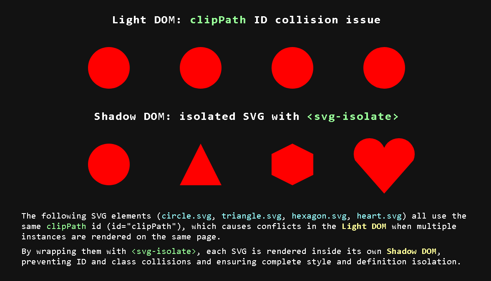

# SVG Isolate Custom Element



## Examples

- [**Codepen Examples**]()

<br>

<!--MARK: Installation -->

## Installation

### NPM

```bash
npm install @components-1812/svg-isolate
```

### CDN

#### Auto-define (recommended)

Loads the bundle and registers `<svg-isolate>` automatically with default styles included.

```html
<script type="module">
	import "https://cdn.jsdelivr.net/npm/@components-1812/svg-isolate/dist/bundle.min.js";
</script>
```

#### Manual definition

Use this if you need a custom tag name or want to provide your own styles.

```html
<script type="module">
	import SVGIsolate from "https://cdn.jsdelivr.net/npm/@components-1812/svg-isolate/dist/SVGIsolate.min.js";

	SVGIsolate.define("custom-svg-isolate", {
		links: [
			"https://cdn.jsdelivr.net/npm/@components-1812/svg-isolate/dist/SVGIsolate.min.css",
		],
	});
</script>
```

### Available files

| File                 | jsdelivr                                                                                  | unpkg                                                                          |
| -------------------- | ----------------------------------------------------------------------------------------- | ------------------------------------------------------------------------------ |
| Bundle (recommended) | [link](https://cdn.jsdelivr.net/npm/@components-1812/svg-isolate/dist/bundle.min.js)      | [link](https://unpkg.com/@components-1812/svg-isolate/dist/bundle.min.js)      |
| SVGIsolate.js        | [link](https://cdn.jsdelivr.net/npm/@components-1812/svg-isolate/dist/SVGIsolate.min.js)  | [link](https://unpkg.com/@components-1812/svg-isolate/dist/SVGIsolate.min.js)  |
| SVGIsolate.css       | [link](https://cdn.jsdelivr.net/npm/@components-1812/svg-isolate/dist/SVGIsolate.min.css) | [link](https://unpkg.com/@components-1812/svg-isolate/dist/SVGIsolate.min.css) |

<br>

<!-- MARK: Usage -->

## Usage

Import the component in a client-side script file:

```js
import "@components-1812/svg-isolate";
```

> This loads the bundle, auto-defines the custom element as `<svg-isolate>`, and applies the default styles via `adoptedStyleSheets`.

```html
<!-- inline SVG -->
<svg-isolate>
	<svg width="200" height="200"><!-- SVG content --></svg>
</svg-isolate>

<!-- load from file -->
<svg-isolate src="path/to/circle.svg" />

<svg-isolate src="path/to/hexagon.svg" loading="lazy" />

<svg-isolate srcset="icon-300.svg 300w, icon-600.svg 600w" />
```

---

### Custom definition

If you need to register the element under a different tag name or inject custom styles into its shadow DOM, use `SVGIsolate.define()` directly instead of the auto-import.

#### Via `adoptedStyleSheets`

Best for programmatically constructed styles or when working with a build system that produces `CSSStyleSheet` objects.

```js
import SVGIsolate from "@components-1812/svg-isolate/SVGIsolate.js";

const sheet = new CSSStyleSheet();
sheet.replaceSync(`
    :host {
        display: inline-block;
    }
`);

SVGIsolate.define("custom-svg-isolate", { adopted: [sheet] });
```

#### Via raw CSS string

Best for inlining styles directly without an external file.

```js
import SVGIsolate from "@components-1812/svg-isolate/SVGIsolate.js";

SVGIsolate.define("custom-svg-isolate", {
	raw: [
		`
        :host {
            display: inline-block;
        }
    `,
	],
});
```

#### Via external stylesheet

Best for loading styles from a CSS file at runtime.

```js
import SVGIsolate from "@components-1812/svg-isolate/SVGIsolate.js";

SVGIsolate.define(null, { links: ["/path/to/styles.css"] });
```

All three options can be combined in a single `define()` call:

```js
SVGIsolate.define("custom-svg-isolate", {
	adopted: [sheet],
	raw: [":host { display: block; }"],
	links: ["/path/to/styles.css"],
});
```

<br>

<!--MARK: Cache -->

## Cache

By default, `<svg-isolate>` caches every SVG source **in memory** after the first fetch, so subsequent requests for the same URL are served instantly without hitting the network.

### Disabling per instance

Use the `no-cache` attribute:

```html
<svg-isolate src="path/to/file.svg" no-cache />
```

Or via the `.useCache` property:

```js
const svg = document.querySelector("svg-isolate");
svg.useCache = false;
```

### Disabling by default

To disable caching for all instances:

```js
SVGIsolate.defaults.useCache = false;
```

### Disabling cache entirely

To disable the cache system completely — no cache is created at `define()` time, `.useCache` always returns `false` and cannot be set to `true`:

```js
SVGIsolate.CACHE_ENABLED = false;
```

Must be set **before** calling `SVGIsolate.define()`.

### Max entries

By default the cache holds up to `100` entries. When the limit is reached, the oldest entry is evicted before adding the new one (FIFO):

```js
SVGIsolate.CACHE_MAX_ENTRIES = 50;
```

Also must be set before calling `SVGIsolate.define()`.

### Shared cache

The cache is shared across all instances of the same component class. Two `<svg-isolate>` elements pointing to the same `src` will only trigger one fetch — the second reuses the cached result.

### Accessing the cache directly

```js
SVGIsolate.CACHE.clear(); // clear all entries
SVGIsolate.CACHE.delete(src); // remove a specific entry
SVGIsolate.CACHE.has(src); // check if a src is cached
SVGIsolate.CACHE.values; // Map with all cached entries
```

#### Preloading

You can manually populate the cache before any component renders:

```js
await SVGIsolate.CACHE.fetchSVG("/assets/icon.svg");
```

This is useful for preloading critical SVGs during app initialization so the first render is instant.

<br>

<!-- MARK: Loading -->

## Loading Strategies

`<svg-isolate>` supports four loading strategies controlled by the `loading` attribute.

### Eager (default)

Fetches the SVG immediately when the element connects to the DOM.

```html
<svg-isolate src="icon.svg" loading="eager" />
```

### Defer

Waits for the `DOMContentLoaded` event before fetching. Useful when the SVG is not critical for the initial render.

```html
<svg-isolate src="icon.svg" loading="defer" />
```

### Idle

Fetches during the browser's idle time using `requestIdleCallback`. Falls back to `defer` if the browser does not support it.

```html
<svg-isolate src="icon.svg" loading="idle" />
```

> **Note:** `requestIdleCallback` is not supported in Safari stable (May 2026). The component automatically falls back to `defer` in that case.

### Lazy

Fetches the SVG only when the element enters the viewport, using `IntersectionObserver`. Ideal for SVGs below the fold.

```html
<svg-isolate src="icon.svg" loading="lazy" />
```

You can control when the load is triggered with `lazy-margin` and `lazy-threshold`:

```html
<svg-isolate
	src="icon.svg"
	loading="lazy"
	lazy-margin="200px"
	lazy-threshold="0.5"
/>
```

- **`lazy-margin`** — extends the viewport boundary before triggering the load. Accepts any valid CSS margin value (e.g. `200px`, `10%`).
- **`lazy-threshold`** — percentage of the element that must be visible before triggering (0 to 1). Default is `0`.

### Setting a default strategy

```js
SVGIsolate.defaults.loading = "lazy";
```

<br>

<!--MARK: Responsive -->

## srcset & Responsive

`<svg-isolate>` supports `srcset` to serve different SVG files depending on the component's rendered **width**, similar to how native `` works.

### Basic usage

Each candidate requires a width descriptor (`w`) representing the intrinsic width the SVG was designed for.

If no descriptor is provided, the candidate defaults to `0w`.

```html
<svg-isolate srcset="icon-300.svg 300w, icon-600.svg 600w, icon-900.svg 900w" />
```

### src and srcset

`src` and `srcset` are mutually exclusive. If `srcset` is present, `src` is ignored entirely — `srcset` always takes priority.

```html
<!-- only srcset is used, src is ignored -->
<svg-isolate src="icon.svg" srcset="icon-300.svg 300w, icon-600.svg 600w" />
```

This also applies when attributes change dynamically — if `srcset` is set at any point, `src` stops being considered until `srcset` is removed.

```js
const el = document.querySelector("svg-isolate");

el.srcset = "icon-300.svg 300w, icon-600.svg 600w"; // src ignored from now on
el.srcset = null; // src is considered again
```

### Candidate selection algorithm

The component measures its own rendered width and picks the smallest candidate whose intrinsic width covers it:

```
component width: 450px
candidates: 300w, 600w, 900w

→ 300w < 450 — does not cover
→ 600w ≥ 450 — covers ✓ → selected
```

If the component is wider than all candidates, the **largest** is used as a fallback.

The selection runs once on connect, and again on every resize if `responsive` is enabled.

### Responsive

By default the component resolves the candidate once on connect. Add the `responsive` attribute to keep listening for size changes and swap the SVG automatically on resize:

```html
<svg-isolate
	srcset="icon-300.svg 300w, icon-600.svg 600w, icon-900.svg 900w"
	responsive
/>
```

Swaps are debounced to avoid excessive fetches during resize. Previously loaded candidates are served from the in-memory cache instantly.

### Setting defaults

```js
SVGIsolate.defaults.responsive = true;
```

<br>

<!-- MARK: Styling the inner SVG -->
## Styling the inner SVG

The SVG rendered inside `<svg-isolate>` lives in a shadow DOM, so external CSS cannot reach it directly. The component provides a few ways to interact with it.

---

### `viewBox`

Sets the `viewBox` attribute on the inner `<svg>` element. Useful for cropping or reframing the SVG coordinate system without modifying the source file.

```html
<svg-isolate src="icon.svg" viewBox="0 0 100 100" />
```

```js
el.viewBox = '0 0 50 50';
```

Changing this attribute dynamically updates the rendered SVG immediately without triggering a reload.

---

### `preserveAspectRatio`

Sets the `preserveAspectRatio` attribute on the inner `<svg>` element. Controls how the SVG scales within its viewport.

```html
<svg-isolate src="icon.svg" preserveAspectRatio="xMidYMid meet" />
```

```js
el.preserveAspectRatio = 'xMinYMin slice';
```

Changing this attribute dynamically updates the rendered SVG immediately without triggering a reload.

---

### `expose-svg`

Adds a `part` attribute to the inner `<svg>` element, making it accessible via `::part()` from external CSS.

```html
<!-- expose with default part name "svg" -->
<svg-isolate src="icon.svg" expose-svg />

<!-- expose with a custom part name -->
<svg-isolate src="icon.svg" expose-svg="my-icon" />
```

```css
/* default name */
svg-isolate::part(svg) {
    fill: red;
    transform: rotate(45deg);
}

/* custom name */
svg-isolate::part(my-icon) {
    fill: red;
}
```

> **Note:** `::part()` gives access to the `<svg>` tag itself. Its children (`path`, `circle`, etc.) remain encapsulated and cannot be targeted from outside. Use [CSS custom properties](#css-custom-properties) to style internals.

#### Enable for all instances

```js
SVGIsolate.defaults.exposeSVG = true;          // exposes with default part name 'svg'
SVGIsolate.defaults.exposeSVG = 'custom-name'; // exposes with a custom part name
```

---

### CSS custom properties

CSS custom properties penetrate the shadow DOM boundary, making them the most flexible way to style SVG internals.

Define the custom property on the component and consume it inside the shadow DOM styles:

```css
svg-isolate {
    --svg-fill: red;
    --svg-stroke: blue;
}
```

```js
// when defining the component, inject a style that consumes the custom properties
SVGIsolate.define('svg-isolate', {
    raw: [`
        svg * {
            fill: var(--svg-fill, currentColor);
            stroke: var(--svg-stroke, none);
        }
    `]
});
```

This approach works for any CSS property regardless of shadow DOM encapsulation.

<br>

<!--MARK: Attributes -->
<!--MARK: Attributes -->
## Attributes

### Reactive

| Attribute | Description |
|-----------|-------------|
| `src` | Path to the SVG file. Triggers a reload when changed. Ignored if `srcset` is present |
| `srcset` | Comma-separated srcset candidates. Takes priority over `src`. Triggers a reload when changed |
| `preserveAspectRatio` | Forwarded directly to the inner `<svg>` without triggering a reload |
| `viewBox` | Forwarded directly to the inner `<svg>` without triggering a reload |

### Behavioral

| Attribute | Default | Description |
|-----------|---------|-------------|
| `loading` | `eager` | Loading strategy. One of `eager`, `defer`, `idle`, `lazy` |
| `responsive` | `false` | Enables automatic candidate swapping on resize |
| `no-cache` | `false` | Disables in-memory caching for this instance |
| `sanitize` | `false` | Enables sanitization before rendering |
| `lazy-margin` | `0px` | Viewport margin before triggering lazy load |
| `lazy-threshold` | `0` | Visibility ratio before triggering lazy load (0 to 1) |
| `expose-svg` | — | Exposes the inner `<svg>` via `::part()`. Accepts an optional custom part name |

### State (read-only)

| Attribute | Description |
|-----------|-------------|
| `ready` | Present when the SVG has been successfully rendered |
| `ready-links` | Present when all external stylesheets have finished loading |

Use these attributes to drive CSS transitions or show loading states while the component initializes.

```css
svg-isolate {
    opacity: 0;
    transition: opacity 0.3s;
}
svg-isolate[ready] {
    opacity: 1;
}
```

```css
svg-isolate:not([ready-links]) {
    opacity: 0;
}
svg-isolate[ready-links] {
    opacity: 1;
}
```

<br>

## Events

| Event | Description |
|-------|-------------|
| `ready` | Fired every time an SVG is successfully rendered — on load, on `src`/`srcset` changes, and on srcset candidate swaps |
| `ready-links` | Fired once when all external stylesheets injected via `links` have finished loading |


<br>

> For full API documentation including properties, methods, return types and parameters, see [docs/api.md](./docs/api.md).

<br>

## License

MIT


